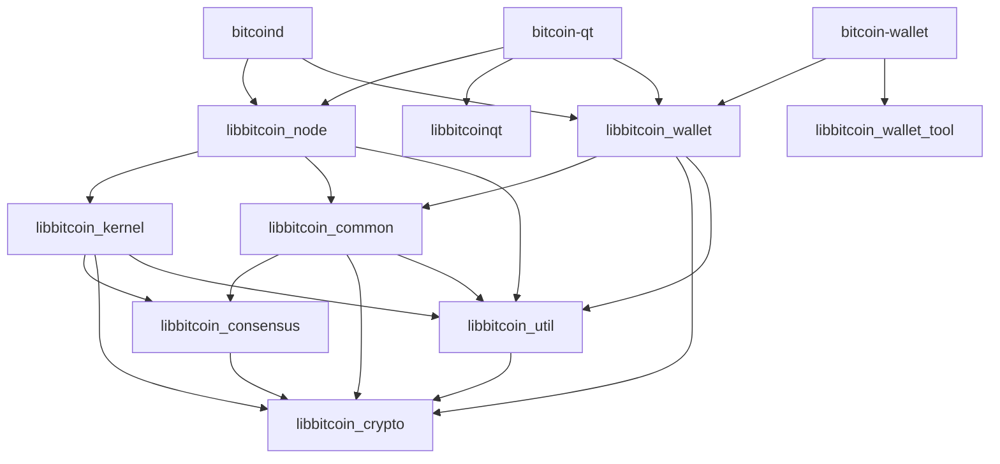
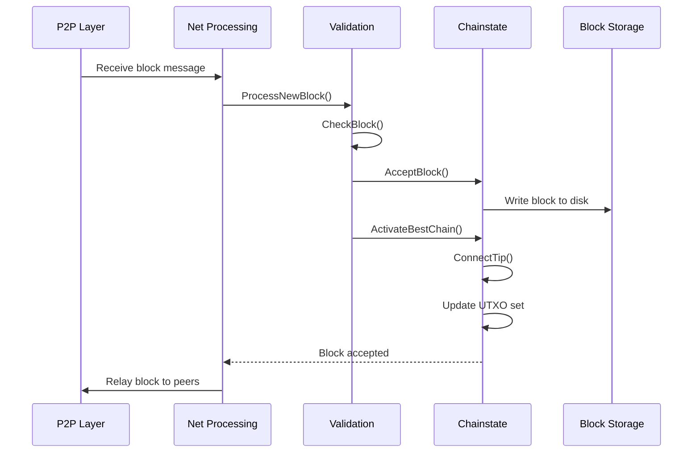
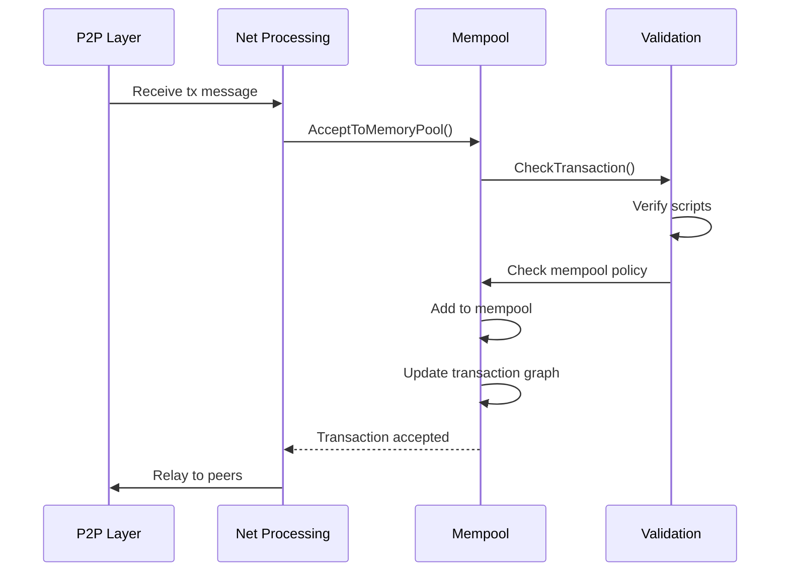
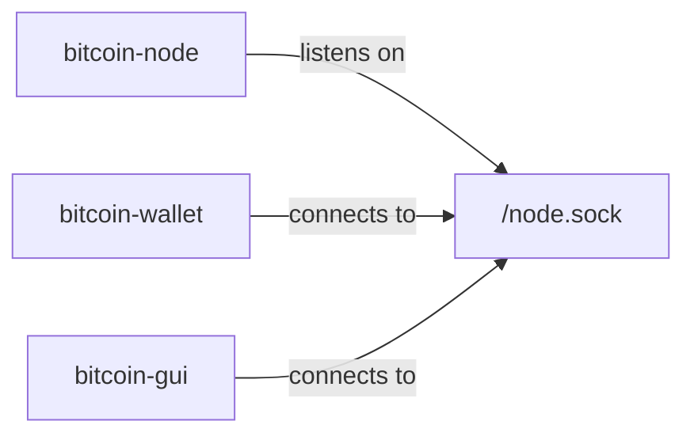

## Introduction

Bitcoin Core is a sophisticated software system that implements the Bitcoin protocol. It serves as both a full node for the Bitcoin network and the reference implementation for Bitcoin's consensus rules. The architecture has evolved from a monolithic design to a more modular structure, separating concerns across distinct libraries and components.

## Core Components

Bitcoin Core is organized into several key subsystems:

### 1. Consensus Engine (libbitcoin_kernel)

The consensus engine is the heart of Bitcoin Core, responsible for validating blocks and transactions according to Bitcoin's consensus rules. It is being extracted into `libbitcoin_kernel` as part of [The libbitcoinkernel Project](https://github.com/bitcoin/bitcoin/issues/27587).

**Key responsibilities:**
- Block validation and chain state management
- UTXO (Unspent Transaction Output) set maintenance
- Consensus rule enforcement
- Script verification

### 2. P2P Network Layer (libbitcoin_node)

The networking layer handles all peer-to-peer communication, block propagation, and transaction relay.

**Key responsibilities:**
- Peer connection management
- Block and transaction propagation
- Network protocol implementation (BIP324 v2 transport)
- DoS protection and peer scoring

### 3. Mempool (CTxMemPool)

The mempool stores unconfirmed transactions and manages their selection for mining.

**Key responsibilities:**
- Transaction validation and storage
- Fee-based transaction ordering
- Cluster linearization for optimal block building
- Replace-by-fee (RBF) policy enforcement

### 4. Wallet (libbitcoin_wallet)

The wallet component manages private keys, addresses, and transaction creation.

**Key responsibilities:**
- Key management and HD wallet support
- Transaction creation and signing
- Address generation (descriptor wallets)
- Coin selection

### 5. RPC/REST Interface

Provides external interfaces for interacting with the node.

**Key responsibilities:**
- JSON-RPC server
- REST API endpoints
- CLI command processing

### 6. Storage Layer

Manages persistent data storage.

**Key responsibilities:**
- Block storage (blk*.dat files)
- UTXO database (LevelDB)
- Block index and chain state
- Wallet database

## Library Architecture

Bitcoin Core uses a layered library architecture to enforce separation of concerns:



### Library Responsibilities

| Library | Description |
|---------|-------------|
| **libbitcoin_crypto** | Hardware-optimized cryptographic primitives (hashing, encryption, signatures) |
| **libbitcoin_consensus** | Consensus-critical validation logic |
| **libbitcoin_util** | Low-level utilities and platform abstractions |
| **libbitcoin_common** | Shared functionality across components |
| **libbitcoin_kernel** | Consensus engine and validation infrastructure |
| **libbitcoin_node** | P2P networking and RPC server |
| **libbitcoin_wallet** | Wallet functionality |
| **libbitcoinqt** | Qt-based GUI |

## Data Flow

### Block Processing Flow



### Transaction Processing Flow



## Multiprocess Architecture

Bitcoin Core is transitioning to a multiprocess architecture for improved security and modularity:



### Benefits of Multiprocess Design

- **Security isolation**: Wallet code runs in a separate process from network-facing code
- **Flexibility**: Components can be started/stopped independently
- **Stability**: Crashes in one component don't affect others
- **Resource management**: Better control over memory and CPU usage per component

### IPC Mechanism

The multiprocess implementation uses Cap'n Proto for inter-process communication:

- Abstract C++ interfaces defined in `src/interfaces/`
- Cap'n Proto schemas in `src/ipc/capnp/`
- Generated code handles marshalling and RPC
- UNIX sockets for local communication

## Chainstate Management

Bitcoin Core uses a `ChainstateManager` to coordinate validation:

- **Single chainstate**: Normal operation during initial block download (IBD)
- **Dual chainstate**: When using assumeutxo snapshots
  - Snapshot chainstate syncs to tip quickly
  - Background chainstate validates history
  - Merge occurs when background reaches snapshot height

## Thread Model

Bitcoin Core uses multiple threads for different tasks:

- **Main thread**: GUI event loop (bitcoin-qt only)
- **Message handler threads**: One per peer connection
- **Script verification threads**: Parallel signature validation (up to 15 threads)
- **Scheduler thread**: Background maintenance tasks
- **HTTP worker threads**: RPC request handling
- **Wallet flush thread**: Periodic wallet database writes

## Key Design Principles

### 1. Separation of Concerns

Libraries have clear boundaries and dependencies flow in one direction (no circular dependencies).

### 2. Consensus Isolation

Consensus-critical code is isolated in `libbitcoin_consensus` and `libbitcoin_kernel` to:
- Prevent accidental consensus changes
- Enable external validation
- Support future consensus engine reuse

### 3. Interface-Based Communication

Components communicate through abstract interfaces (`src/interfaces/`) rather than direct coupling:
- Node ↔ Wallet communication via `interfaces::Chain`
- Node ↔ GUI communication via `interfaces::Node`
- Enables multiprocess architecture

### 4. Validation vs Policy

Clear distinction between:
- **Consensus rules**: What makes a block/transaction valid
- **Policy rules**: What transactions to relay and mine

## File Organization

Key source directories:

```
src/
├── consensus/       # Consensus-critical validation logic
├── script/          # Script interpreter and signing
├── crypto/          # Cryptographic primitives
├── kernel/          # Consensus engine (libbitcoinkernel)
├── node/            # Node-specific logic
├── net.cpp          # P2P networking layer
├── net_processing.cpp  # P2P message handling
├── validation.cpp   # Block and transaction validation
├── txmempool.cpp    # Mempool implementation
├── wallet/          # Wallet functionality
├── rpc/             # RPC server and commands
├── interfaces/      # Abstract interfaces for IPC
└── qt/              # Qt GUI
```

## Database Technologies

- **LevelDB**: UTXO set and block index
- **SQLite**: Descriptor wallet storage
- **Berkeley DB**: Legacy wallet format (deprecated)
- **Flat files**: Raw block and undo data (blk*.dat, rev*.dat)

## Build System

Bitcoin Core uses CMake (modern) with legacy Autotools support:

- Modular build configuration
- Optional components (wallet, GUI, tests)
- Cross-platform support (Linux, macOS, Windows, BSD)
- Dependency management via vcpkg or system packages

## Related Documentation

- [Validation Engine](/development/validation-engine) - Deep dive into block and transaction validation
- [Mempool](/development/mempool) - Transaction mempool architecture
- [P2P Protocol](/development/p2p-protocol) - Network layer implementation
- [Consensus Layer](/development/consensus-layer) - Consensus rules and BIP implementations
