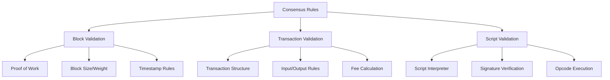
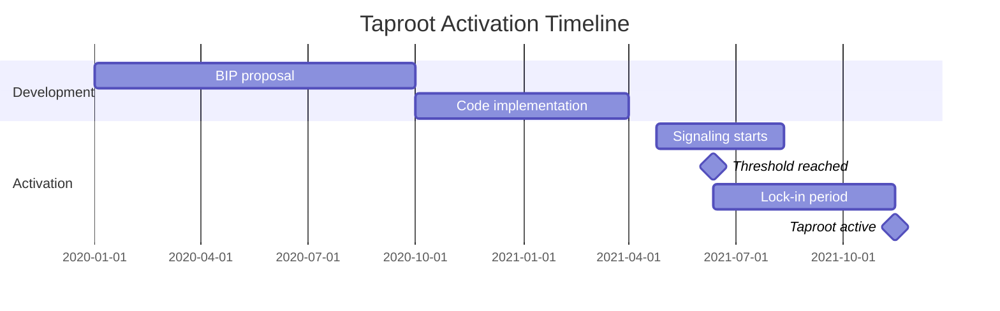

## Overview

The consensus layer defines the rules that determine which blocks and transactions are valid in Bitcoin. These rules must be followed by all nodes to maintain network consensus. Bitcoin Core implements these rules in a modular fashion, with consensus-critical code isolated in specific libraries.

**Primary locations:**
- `src/consensus/` - Core consensus validation
- `src/script/interpreter.cpp` - Script execution
- `src/validation.cpp` - Block and transaction validation
- `libbitcoin_consensus` - Consensus library

## Consensus Architecture



## Consensus Parameters

### Chain Parameters

Defined in `src/consensus/params.h`:

```cpp
struct Params {
    uint256 hashGenesisBlock;
    int nSubsidyHalvingInterval;        // 210,000 blocks
    
    // Soft fork activation heights
    int BIP34Height;                     // Coinbase height
    int BIP65Height;                     // OP_CHECKLOCKTIMEVERIFY
    int BIP66Height;                     // Strict DER signatures
    int CSVHeight;                       // OP_CHECKSEQUENCEVERIFY
    int SegwitHeight;                    // Segregated Witness
    
    // Proof-of-work parameters
    uint256 powLimit;                    // Maximum target
    int64_t nPowTargetSpacing;          // 10 minutes
    int64_t nPowTargetTimespan;         // 2 weeks
    
    // Deployment tracking
    std::array<BIP9Deployment, MAX_VERSION_BITS_DEPLOYMENTS> vDeployments;
};
```

### Network-Specific Values

**Mainnet:**
- Target block time: 600 seconds (10 minutes)
- Difficulty adjustment: Every 2016 blocks
- Subsidy halving: Every 210,000 blocks
- Initial subsidy: 50 BTC
- Maximum supply: ~21 million BTC

**Testnet:**
- Same rules as mainnet
- Minimum difficulty blocks allowed
- Different genesis block

**Regtest:**
- Instant mining (difficulty = 1)
- No peers required
- Customizable parameters

## Block Consensus Rules

### Block Header Validation

```cpp
bool CheckProofOfWork(uint256 hash, unsigned int nBits, const Consensus::Params& params)
```

**Rules:**
1. **Hash < Target**: Block hash must be below difficulty target
2. **Timestamp**: Not more than 2 hours in the future
3. **Version**: Recognized version number
4. **Previous block**: Must reference known block

### Block Structure Rules

**Size and weight limits:**
```cpp
static const unsigned int MAX_BLOCK_SERIALIZED_SIZE = 4'000'000; // 4MB
static const unsigned int MAX_BLOCK_WEIGHT = 4'000'000;          // 4M weight units
```

**Weight calculation:**
```cpp
weight = base_size * 3 + total_size
```
- Base size: Transaction size without witness data
- Total size: Complete transaction size including witness

**Witness scale factor:**
```cpp
static const unsigned int WITNESS_SCALE_FACTOR = 4;
```

### Coinbase Transaction

**Requirements:**
1. First transaction in block must be coinbase
2. Exactly one coinbase per block
3. Coinbase input must have:
   - Previous output: null hash (0x00...00)
   - Output index: 0xFFFFFFFF
   - Script sig: 2-100 bytes (includes height per BIP34)

**Coinbase output value:**
```cpp
CAmount GetBlockSubsidy(int nHeight, const Consensus::Params& consensusParams) {
    int halvings = nHeight / consensusParams.nSubsidyHalvingInterval;
    if (halvings >= 64) return 0;
    
    CAmount nSubsidy = 50 * COIN;
    nSubsidy >>= halvings;  // Divide by 2^halvings
    return nSubsidy;
}
```

**Total value constraint:**
```
coinbase_output_value ≤ subsidy + transaction_fees
```

## Transaction Consensus Rules

### Transaction Structure

```cpp
class CTransaction {
    int32_t nVersion;
    std::vector<CTxIn> vin;
    std::vector<CTxOut> vout;
    uint32_t nLockTime;
    // Witness data (not in txid hash)
};
```

### Basic Transaction Rules

1. **Version**: Currently 1 or 2 (version 3 for TRUC)
2. **Inputs**: At least 1 input (except coinbase)
3. **Outputs**: At least 1 output
4. **Output values**: Each output ≥ 0, total < 21M BTC
5. **Size**: ≤ 400,000 weight units

### Input Validation

```cpp
class CTxIn {
    COutPoint prevout;    // (txid, vout) of output being spent
    CScript scriptSig;    // Spending script
    uint32_t nSequence;   // Sequence number (for timelock)
    CScriptWitness scriptWitness;  // Witness data (SegWit)
};
```

**Rules:**
1. Referenced output must exist in UTXO set
2. Not already spent (no double-spends)
3. Script validation passes
4. Sequence/locktime constraints satisfied

### Output Validation

```cpp
class CTxOut {
    CAmount nValue;       // Amount in satoshis
    CScript scriptPubKey; // Locking script
};
```

**Rules:**
1. Value ≥ 0
2. Value ≤ 21M BTC (consensus limit)
3. Sum of outputs ≤ sum of inputs (for non-coinbase)

## Script Validation

### Script Types

Bitcoin supports multiple script types:

#### 1. Pay to Public Key Hash (P2PKH)

```
scriptPubKey: OP_DUP OP_HASH160 <pubKeyHash> OP_EQUALVERIFY OP_CHECKSIG
scriptSig:    <signature> <pubKey>
```

#### 2. Pay to Script Hash (P2SH - BIP16)

```
scriptPubKey: OP_HASH160 <scriptHash> OP_EQUAL
scriptSig:    <data> ... <redeemScript>
```

**Activation:** Block 173,805 (April 1, 2012)

**Validation:**
1. Verify scriptSig + scriptPubKey
2. Extract redeemScript from scriptSig
3. Verify redeemScript execution

#### 3. Pay to Witness Public Key Hash (P2WPKH - BIP141)

```
scriptPubKey: OP_0 <20-byte-hash>
witness:      <signature> <pubkey>
```

**Benefits:**
- Fixes transaction malleability
- More efficient (lower fees)
- Enables Lightning Network

#### 4. Pay to Witness Script Hash (P2WSH - BIP141)

```
scriptPubKey: OP_0 <32-byte-hash>
witness:      <data> ... <witnessScript>
```

#### 5. Pay to Taproot (P2TR - BIP341)

```
scriptPubKey: OP_1 <32-byte-pubkey>
witness:      <signature>  (key path)
         OR:  <data> ... <script> <control_block>  (script path)
```

**Features:**
- Schnorr signatures (BIP340)
- MAST (Merkelized Alternative Script Trees)
- Tapscript (BIP342)
- Better privacy and efficiency

### Script Interpreter

Script execution in `src/script/interpreter.cpp`:

```cpp
bool EvalScript(std::vector<std::vector<unsigned char>>& stack,
                const CScript& script,
                unsigned int flags,
                const BaseSignatureChecker& checker,
                SigVersion sigversion,
                ScriptError* serror)
```

**Process:**
1. Execute scriptSig → produces stack
2. Execute scriptPubKey with that stack
3. Top stack element must be true
4. For P2SH/P2WSH: Additional script execution

### Signature Validation

#### ECDSA (Legacy and SegWit v0)

```cpp
bool CheckSignatureEncoding(const std::vector<unsigned char>& vchSig,
                           unsigned int flags,
                           ScriptError* serror)
```

**Requirements:**
- DER encoding (BIP66)
- Low-S values (BIP146)
- Proper SIGHASH type
- Valid secp256k1 signature

#### Schnorr (Taproot/SegWit v1)

```cpp
bool VerifySchnorrSignature(Span<const unsigned char> sig,
                           const XOnlyPubKey& pubkey,
                           const uint256& sighash)
```

**Benefits:**
- 64-byte signatures (vs ~72 for ECDSA)
- Batch verification
- Key aggregation (MuSig2)
- Provable security

## Soft Fork Mechanisms

### Buried Deployments (BIP90)

Soft forks activated at specific heights:

```cpp
enum BuriedDeployment : int16_t {
    DEPLOYMENT_HEIGHTINCB,  // BIP34 - Coinbase height
    DEPLOYMENT_CLTV,        // BIP65 - CHECKLOCKTIMEVERIFY  
    DEPLOYMENT_DERSIG,      // BIP66 - Strict DER signatures
    DEPLOYMENT_CSV,         // BIP68/112/113 - CHECKSEQUENCEVERIFY
    DEPLOYMENT_SEGWIT,      // BIP141/143/147 - Segregated Witness
};
```

These are "buried" because they activated long ago and are now enforced unconditionally.

### BIP9 Version Bits

Flexible soft fork deployment:

```cpp
struct BIP9Deployment {
    int bit;                    // Version bit (0-28)
    int64_t nStartTime;        // Earliest activation
    int64_t nTimeout;          // Latest activation
    int min_activation_height; // Minimum height
    uint32_t period;           // Signal period (2016 blocks)
    uint32_t threshold;        // Activation threshold (1916/2016 = 95%)
};
```

**States:**
```cpp
enum class ThresholdState {
    DEFINED,    // Before start time
    STARTED,    // Signaling period active
    LOCKED_IN,  // Threshold met, waiting for activation
    ACTIVE,     // Rules enforced
    FAILED,     // Timeout without activation
};
```

**Taproot activation (BIP341/342):**
- Bit: 2
- Start time: April 24, 2021
- Timeout: August 11, 2021
- Activation height: 709,632 (November 2021)
- Status: ACTIVE

## Implemented BIPs

Bitcoin Core implements numerous BIPs (Bitcoin Improvement Proposals):

### Consensus Changes

| BIP | Description | Version | Status |
|-----|-------------|---------|--------|
| BIP16 | Pay to Script Hash (P2SH) | v0.6.0 | Active since 2012 |
| BIP30 | Duplicate txid prevention | v0.6.0 | Active since 2012 |
| BIP34 | Block height in coinbase | v0.7.0 | Buried |
| BIP65 | OP_CHECKLOCKTIMEVERIFY | v0.12.0 | Buried |
| BIP66 | Strict DER signatures | v0.10.0 | Buried |
| BIP68 | Relative lock-time | v0.12.1 | Buried |
| BIP112 | OP_CHECKSEQUENCEVERIFY | v0.12.1 | Buried |
| BIP113 | Median time-past | v0.12.1 | Buried |
| BIP141 | Segregated Witness (consensus) | v0.13.0 | Buried |
| BIP143 | Transaction signature verification (SegWit) | v0.13.0 | Buried |
| BIP147 | NULLDUMMY | v0.13.1 | Buried |
| BIP340 | Schnorr signatures | v0.21.0 | Active |
| BIP341 | Taproot | v0.21.0 | Active |
| BIP342 | Tapscript | v0.21.0 | Active |
| BIP431 | TRUC (v3 transactions) | v28.0 | Active |

### Network Protocol

| BIP | Description | Version |
|-----|-------------|---------|
| BIP14 | Protocol version and user agent | v0.6.0 |
| BIP31 | Pong message | v0.6.1 |
| BIP35 | Mempool message | v0.7.0 |
| BIP130 | Direct headers announcement | v0.12.0 |
| BIP133 | feefilter message | v0.13.0 |
| BIP152 | Compact block relay | v0.13.0 |
| BIP155 | addrv2 message | v0.21.0 |
| BIP324 | Version 2 P2P transport | v26.0 |
| BIP339 | Wtxid relay | v0.21.0 |

### Wallet and Addresses

| BIP | Description | Version |
|-----|-------------|---------|
| BIP32 | Hierarchical Deterministic Wallets | v0.13.0 |
| BIP39 | Mnemonic code (external implementation) | - |
| BIP44 | Multi-account hierarchy | v0.21.0 |
| BIP49 | Derivation for P2WPKH-nested-in-P2SH | v0.21.0 |
| BIP84 | Derivation for P2WPKH | v0.21.0 |
| BIP86 | Derivation for P2TR | v23.0 |
| BIP173 | Bech32 address format | v0.16.0 |
| BIP174 | Partially Signed Bitcoin Transactions (PSBT) | v0.17.0 |
| BIP350 | Bech32m address format | v22.0 |
| BIP371 | Taproot fields for PSBT | v24.0 |
| BIP380-385 | Output script descriptors | v0.17.0 |
| BIP386 | tr() descriptors | v22.0 |

## Consensus-Critical Code

### Isolation Strategy

Consensus code is carefully isolated:

```cpp
// src/consensus/
validation.h      // Validation state classes
tx_check.cpp      // Transaction structure checks
tx_verify.cpp     // Transaction input verification  
merkle.cpp        // Merkle tree computation
params.h          // Consensus parameters
```

**Design principles:**
1. No external dependencies (except crypto)
2. Deterministic behavior
3. No floating-point arithmetic
4. Careful integer overflow handling
5. Identical behavior across platforms

### libbitcoin_consensus

Extractable consensus library:

```cpp
// Public API
bitcoinconsensus_verify_script(
    const unsigned char *scriptPubKey,
    unsigned int scriptPubKeyLen,
    const unsigned char *txTo,
    unsigned int txToLen,
    unsigned int nIn,
    unsigned int flags,
    bitcoinconsensus_error* err
);
```

**Use cases:**
- Alternative implementations can validate using Bitcoin Core's consensus
- Third-party verification
- Cross-platform consensus checking

## Validation Caching

### Script Execution Cache

Caches script execution results:

```cpp
class CachingTransactionSignatureChecker : public TransactionSignatureChecker {
    bool VerifySignature(...);
    // Caches (txid, script, flags) -> valid/invalid
};
```

**Cache types:**
1. **Signature cache**: Individual signature verifications
2. **Script cache**: Full script execution results

**Benefits:**
- Avoid re-executing scripts during reorgs
- Faster block validation
- Reduced CPU usage

### Assumevalid

Skip signature validation for old blocks:

```cpp
uint256 defaultAssumeValid = uint256S("0x...");  // Updated each release
```

**Security model:**
- Relies on proof-of-work accumulation
- All other consensus rules still enforced
- Significantly faster initial sync
- Configurable via `-assumevalid=<hash>`

## Time Locks

### Absolute Time Locks

**nLockTime (transaction-level):**
```cpp
uint32_t nLockTime;  // Block height or Unix timestamp
```

**OP_CHECKLOCKTIMEVERIFY (BIP65):**
- Script-level absolute time lock
- Compares against nLockTime
- Enables refund transactions

### Relative Time Locks

**nSequence (input-level - BIP68):**
```cpp
uint32_t nSequence;
// Bit 31: Disable flag
// Bit 22: Type flag (0=block height, 1=time)
// Bits 0-15: Value
```

**OP_CHECKSEQUENCEVERIFY (BIP112):**
- Script-level relative time lock
- Enables payment channels
- Used in Lightning Network

### Median Time Past (BIP113)

Time locks compare against median of last 11 blocks:

```cpp
int64_t GetMedianTimePast(const CBlockIndex* pindex);
```

**Benefits:**
- Prevents miner time manipulation
- More reliable than single block timestamp

## Consensus Upgrades in Practice

### Activation Process

1. **Proposal**: BIP drafted and discussed
2. **Implementation**: Code merged (inactive)
3. **Signaling**: Miners signal readiness via version bits
4. **Lock-in**: Threshold reached (95% of 2016 blocks)
5. **Activation**: Rules enforced after lock-in period

### Recent Example: Taproot



## Future Considerations

### Potential Soft Forks

**Under discussion:**
- ANYPREVOUT (BIP118) - Signature flexibility for eltoo
- CHECKSIGFROMSTACK - Covenant functionality  
- OP_CAT - Concatenation operation
- Cross-input signature aggregation

### Consensus Evolution

**Challenges:**
- Backward compatibility
- Decentralized coordination
- Testing and verification
- Long-term maintenance

**Process improvements:**
- Better soft fork deployment mechanisms
- More comprehensive testing (fuzzing, formal verification)
- Clearer activation paths

## Related Documentation

- [Validation Engine](/development/validation-engine) - Validation implementation details
- [Architecture Overview](/development/architecture-overview) - System architecture
- [BIPs Documentation](https://github.com/bitcoin/bips) - Bitcoin Improvement Proposals
