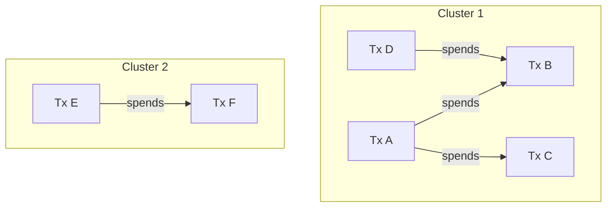
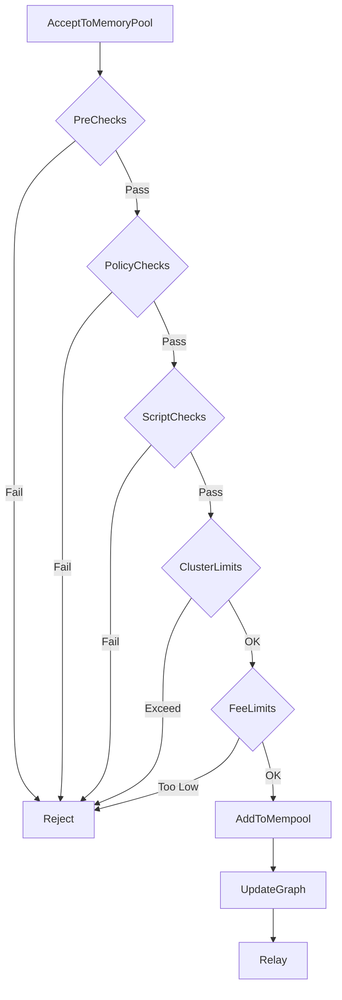

## Overview

The mempool (memory pool) is a critical component that stores valid but unconfirmed transactions. It serves as a staging area for transactions before they are included in blocks and plays a key role in transaction relay, fee estimation, and block template construction.

**Primary file:** `src/txmempool.cpp` and `src/txmempool.h`

## Core Concepts

### CTxMemPool Class

The main mempool class stores and manages unconfirmed transactions:

```cpp
class CTxMemPool {
    indexed_transaction_set mapTx;  // All mempool transactions
    TxGraph m_txgraph;              // Transaction dependency graph
    CCoinsViewCache coins;          // UTXO view including mempool
    // ...
};
```

**Key responsibilities:**
- Transaction validation and storage
- Dependency tracking (parent/child relationships)
- Fee-based ordering for mining
- Cluster linearization for optimal block building
- Eviction when size limits are reached

### Transaction Entry

Each transaction in the mempool has associated metadata:

```cpp
class CTxMemPoolEntry {
    CTransactionRef tx;             // The transaction
    CAmount nFee;                   // Fee paid
    int64_t nTime;                  // Entry time
    int64_t nSigOpCost;            // Signature operation cost
    int64_t nModifiedFee;          // Fee + priority adjustments
    int64_t nUsageSize;            // Memory usage
    // ...
};
```

## Transaction Graph (TxGraph)

The `TxGraph` component manages transaction dependencies and cluster analysis:

### Purpose

Separates graph-theoretical aspects from Bitcoin-specific logic:
- Track parent/child relationships
- Partition mempool into connected clusters
- Compute optimal transaction orderings
- Enforce cluster size limits

### Cluster Formation

Transactions are grouped into clusters based on spending relationships:



**Cluster properties:**
- Connected component of the transaction graph
- Transactions in a cluster may depend on each other
- Different clusters are completely independent
- Mining can select transactions cluster-by-cluster

### Cluster Limits

To prevent DoS and ensure efficient processing:

```cpp
static constexpr uint32_t MAX_CLUSTER_COUNT = 500;  // Max transactions
static constexpr uint32_t MAX_CLUSTER_WEIGHT = 101'000;  // Max weight (vbytes)
```

Transactions that would create oversized clusters are rejected.

## Linearization Algorithm

The mempool uses sophisticated algorithms to order transactions for optimal fee collection.

### Feerate Diagram

Transactions are analyzed using "feerate diagrams" that plot cumulative size vs. fees:

```
Cumulative Fee ↑
              |
              |     ╱
              |    ╱
              |   ╱HighFee
              |  ╱
              | ╱
              |╱____LowFee
              +------------→ Cumulative Size
```

Better linearizations have diagrams that are higher and to the left.

### Ancestor-Based Sorting

Traditional approach (pre-cluster linearization):

1. Calculate ancestor score for each transaction:
   ```
   ancestor_score = (fee + ancestor_fees) / (size + ancestor_sizes)
   ```

2. Select transactions in descending ancestor score order

3. Ensures CPFP (Child Pays For Parent) works correctly

**Limitations:**
- Doesn't account for descendants
- May not find optimal orderings
- Complex dependency tracking

### Cluster Linearization

Modern approach using `cluster_linearize.h`:

```cpp
template<typename SetType>
std::vector<ClusterIndex> Linearize(const SetType& cluster,
                                    uint64_t max_iterations);
```

**Algorithm:**
1. Partition cluster into "chunks" (sets of transactions)
2. Use search algorithm to find high-feerate chunks
3. Order chunks by feerate
4. Linearization is concatenation of chunk orderings

**Improvements:**
- Considers both ancestors and descendants
- Finds provably better orderings
- Bounded computation time
- Enables Replace-By-Fee improvements

### Search Cost Limiting

```cpp
static constexpr uint64_t ACCEPTABLE_COST = 75'000;
static constexpr uint64_t POST_CHANGE_COST = 5 * ACCEPTABLE_COST;
```

Linearization is computationally intensive, so:
- Quick search for most clusters
- Deeper search after mempool changes
- Accept "good enough" solutions for complex clusters

## Mempool Admission

### AcceptToMemoryPool Flow



### Policy Rules

Transactions must meet policy requirements:

**Size and Weight:**
- Minimum size: 82 bytes (to prevent spam)
- Maximum weight: 400,000 (consensus limit)
- Maximum sigop cost: 80,000

**Fees:**
- Minimum relay fee: 1 sat/vB (default)
- Incremental relay fee: Used for RBF
- Dynamic minimum based on mempool fullness

**Standard Transaction Types:**
- P2PKH (Pay to Public Key Hash)
- P2SH (Pay to Script Hash)
- P2WPKH (Pay to Witness Public Key Hash)
- P2WSH (Pay to Witness Script Hash)
- P2TR (Pay to Taproot)
- Multisig (up to 3-of-3)

**Version 3 Transactions (BIP431):**
- Topologically Restricted Until Confirmation (TRUC)
- Limited to 1 ancestor, 1 descendant
- Enables package RBF
- Supports Lightning Network penalty transactions

## Replace-By-Fee (RBF)

RBF allows replacing mempool transactions with higher-fee versions.

### BIP125 Rules

A replacement transaction must:

1. **Signal replaceability**: Original tx has sequence number < 0xfffffffe
2. **Pay higher fee**: New tx pays more absolute fee
3. **Pay for bandwidth**: Additional fee ≥ relay fee for new tx size
4. **Pay for replaced**: Fee rate ≥ replaced transactions' fee rates
5. **Limit conflicts**: ≤ 100 replaced transactions

### Implementation

```cpp
struct ATMPArgs {
    const CChainParams& m_chainparams;
    bool m_test_accept{false};
    bool m_allow_replacement{true};
    bool m_package_submission{false};
    // ...
};
```

Replacement logic in `AcceptToMemoryPool`:
1. Identify all conflicts (transactions spending same inputs)
2. Check RBF rules
3. Remove conflicting transactions and descendants
4. Add new transaction
5. Update graph and linearization

## Package Acceptance

Package relay allows submitting multiple transactions together.

### Motivation

Individual transactions may not meet minimum fees, but as a package they do:

```
Parent (low fee) + Child (high fee) = Package (acceptable fee rate)
```

### Package Validation

```cpp
PackageMempoolAcceptResult ProcessNewPackage(
    Chainstate& active_chainstate,
    CTxMemPool& pool,
    const Package& package,
    bool test_accept);
```

**Package types:**
- **Child-with-unconfirmed-parents**: Most common for CPFP
- **2-transaction TRUC**: Lightning Network use case

**Validation:**
1. Validate each transaction individually (may fail on fees)
2. Calculate package feerate
3. Re-validate low-fee transactions with package context
4. Accept package if total meets requirements

## Eviction Policy

When mempool exceeds size limit (default: 300 MB):

### Eviction Algorithm

```cpp
void CTxMemPool::TrimToSize(size_t sizelimit);
```

1. **Calculate target**: Evict to get below limit
2. **Sort by modified feerate**: Lowest first
3. **Evict with descendants**: Can't keep orphans
4. **Update graph**: Recompute after eviction

**Modified feerate:**
```
modified_feerate = (fee + descendant_fees + priority_delta) / 
                   (size + descendant_sizes)
```

### Priority Adjustment

Node operators can prioritize transactions:

```cpp
void PrioritiseTransaction(const uint256& txid, int64_t fee_delta);
```

Use cases:
- Mining pool policies
- Out-of-band fee agreements
- Emergency transaction acceleration

## Memory Management

### Memory Usage Tracking

```cpp
size_t CTxMemPool::DynamicMemoryUsage() const {
    return memusage::DynamicUsage(mapTx) +
           memusage::DynamicUsage(m_txgraph) +
           // ... other structures
}
```

**Tracked memory:**
- Transaction data
- Boost multi-index overhead
- TxGraph structures
- UTXO view cache

### Size Limits

```cpp
static constexpr unsigned int DEFAULT_MAX_MEMPOOL_SIZE_MB = 300;
static constexpr unsigned int DEFAULT_MAX_MEMPOOL_SIZE = 
    DEFAULT_MAX_MEMPOOL_SIZE_MB * 1'000'000;
```

Configurable via `-maxmempool=<n>` (in MB).

## Indexes and Lookups

The mempool uses Boost.MultiIndex for efficient queries:

```cpp
typedef boost::multi_index_container<
    CTxMemPoolEntry,
    boost::multi_index::indexed_by<
        boost::multi_index::hashed_unique<mempoolentry_txid>,
        boost::multi_index::hashed_unique<mempoolentry_wtxid>,
        boost::multi_index::ordered_non_unique<entry_time>
    >
> indexed_transaction_set;
```

**Index types:**
- **By txid**: O(1) lookup by transaction ID
- **By wtxid**: O(1) lookup by witness transaction ID
- **By time**: Chronological ordering

## Orphan Transactions

Orphans are transactions whose inputs aren't in mempool or UTXO set:

```cpp
class TxOrphanage {
    std::map<Txid, OrphanTx> m_orphans;
    std::map<COutPoint, std::set<Txid>> m_outpoint_to_orphan_it;
    // ...
};
```

**Handling:**
1. Store orphan temporarily (max 100 by default)
2. When parent arrives, retry orphan validation
3. Expire old orphans (20 minutes)
4. Limit total orphan memory

## Fee Estimation

The mempool tracks confirmation times to estimate fees:

```cpp
class CBlockPolicyEstimator {
    // Tracks tx confirmation by fee rate and time
    // Produces fee estimates for N-block confirmation target
};
```

**Algorithm:**
1. Record when transactions enter mempool
2. Record when they confirm (and at what fee rate)
3. Build statistical model of confirmation time vs. fee rate
4. Estimate fee for desired confirmation time

## ZMQ Notifications

Mempool events can be published via ZeroMQ:

```cpp
// Notifications
zmqpubhashtx           // New transaction
zmqpubrawmempool       // Full mempool dump
zmqpubsequence         // Sequence of mempool events
```

## Mempool Persistence

Mempool state is saved on shutdown:

```
<datadir>/mempool.dat
```

**Saved data:**
- All transactions
- Entry times
- Fee deltas (prioritization)

**On restart:**
- Load saved transactions
- Re-validate against current chain tip
- Reject now-invalid transactions

## Testing and Simulation

### Test Framework

```python
# test/functional/mempool_*.py
test_mempool_accept()  # Policy tests
test_mempool_package() # Package relay
test_rbf()             # Replace-by-fee
test_cluster_limits()  # Cluster limits
```

### Mempool Stress Testing

```cpp
// test/fuzz/tx_pool.cpp
FUZZ_TARGET(tx_pool) {
    // Randomized mempool operations
    // Validates invariants after each operation
}
```

## Performance Optimization

### Caching Strategies

- **Witness hash calculation**: Cached in `CTransaction`
- **Signature verification**: Shared signature cache
- **Coins view**: Mempool-specific UTXO cache

### Batch Operations

- **Block connection**: Remove many transactions atomically
- **Graph updates**: Defer recomputation until needed
- **Linearization**: Amortize cost across multiple changes

## Related Documentation

- [Validation Engine](/development/validation-engine)
- [P2P Protocol](/development/p2p-protocol)
- [Architecture Overview](/development/architecture-overview)
