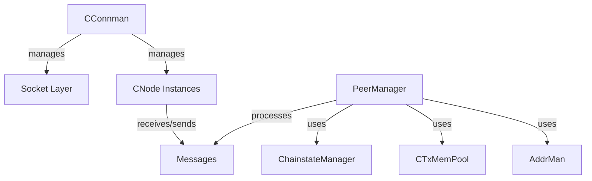
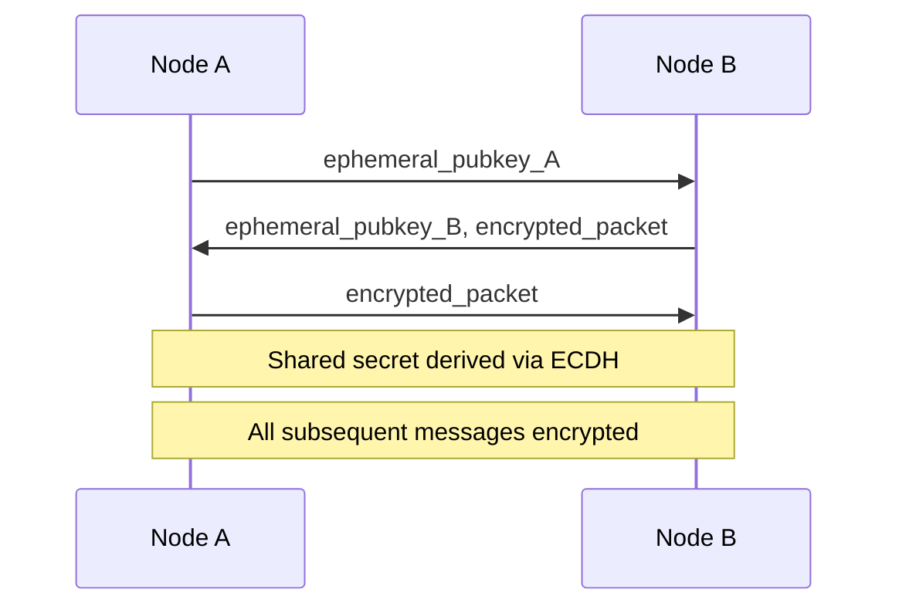
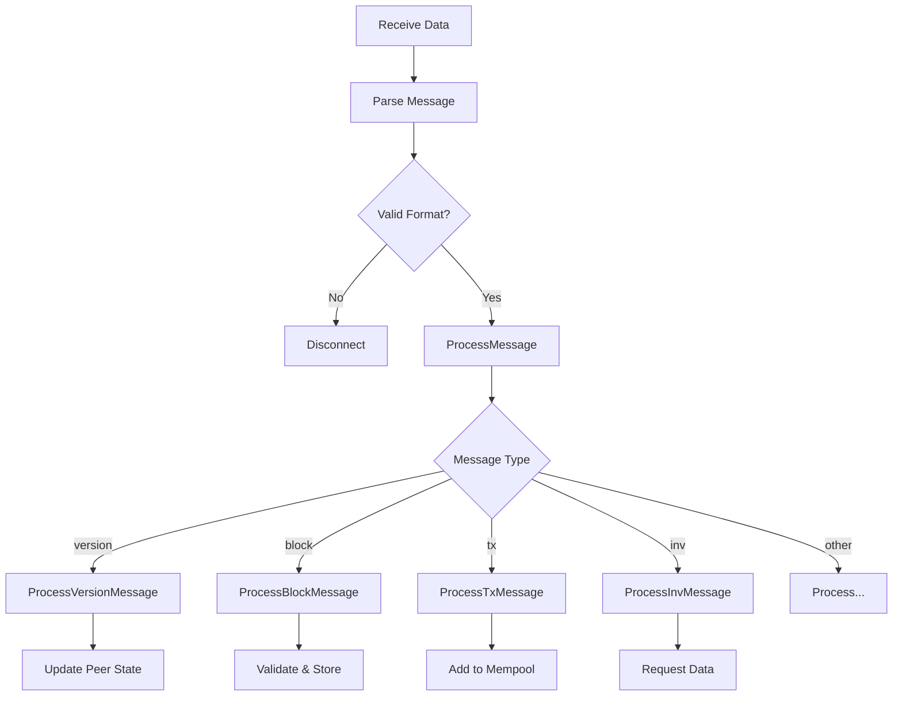

## Overview

Bitcoin Core's P2P (peer-to-peer) layer handles all network communication between nodes. It manages peer connections, message exchange, block propagation, transaction relay, and network security.

**Primary files:**
- `src/net.cpp` / `src/net.h` - Core networking (CConnman, CNode)
- `src/net_processing.cpp` / `src/net_processing.h` - Protocol message handling
- `src/protocol.cpp` / `src/protocol.h` - Message format definitions

## Network Architecture



### Key Components

#### CConnman (Connection Manager)

Manages all network connections:

```cpp
class CConnman {
    std::vector<CNode*> vNodes;           // All connected peers
    CSemaphoreGrant semOutbound;          // Outbound connection limit
    CSemaphoreGrant semAddnode;           // Manual connection limit
    std::vector<std::string> vSeedNodes;  // DNS seeds
    // ...
};
```

**Responsibilities:**
- Socket management and I/O
- Connection establishment and cleanup
- Peer discovery and connection strategy
- Rate limiting and bandwidth management

#### CNode (Peer Connection)

Represents a single peer:

```cpp
class CNode {
    NodeId id;                            // Unique peer identifier
    CService addr;                        // IP address and port
    std::deque<CSerializedNetMsg> vSendMsg; // Outbound message queue
    ServiceFlags nServices;               // Peer capabilities
    int64_t nTimeConnected;              // Connection timestamp
    // ...
};
```

#### PeerManager

Handles protocol-level logic:

```cpp
class PeerManager : public CValidationInterface {
    void ProcessMessage(CNode& node, 
                       const std::string& msg_type,
                       DataStream& vRecv);
    void SendMessages(CNode* pto);
    // ...
};
```

**Responsibilities:**
- Message processing
- Block and transaction relay
- Peer misbehavior tracking
- Inventory management

## Connection Types

Bitcoin Core maintains different types of connections:

### Outbound Connections

```cpp
enum class ConnectionType {
    OUTBOUND_FULL_RELAY,    // Full relay (blocks + txs)
    BLOCK_RELAY,            // Block-relay-only
    FEELER,                 // Test connection
    MANUAL,                 // -addnode/-connect
    ADDR_FETCH,             // Fetch addresses only
};
```

**Configuration:**
```cpp
static const int MAX_OUTBOUND_FULL_RELAY_CONNECTIONS = 8;
static const int MAX_BLOCK_RELAY_ONLY_CONNECTIONS = 2;
static const int MAX_FEELER_CONNECTIONS = 1;
```

### Inbound Connections

Accepted from other peers:
- Default max: 125 total connections
- After maxconnections reached, new inbound connections are rejected
- Exceptions for whitelisted peers

## Peer Discovery

### Address Manager (AddrMan)

Stores and manages peer addresses:

```cpp
class AddrMan {
    // Two tables: tried and new
    // Tried: addresses we've successfully connected to
    // New: addresses we haven't tried yet
};
```

**Address sources:**
1. **DNS seeds**: Hardcoded DNS names that return peer IPs
2. **Seed nodes**: Hardcoded IP addresses (fallback)
3. **ADDR messages**: Peers share addresses
4. **Manual**: `-addnode`, `-connect` parameters

### Address Selection

When choosing peers to connect to:

```cpp
CAddress AddrMan::Select(bool newOnly = false);
```

**Strategy:**
- Prefer tried addresses (50% of the time)
- New addresses selected randomly from "new" table
- Group addresses by /16 subnet to ensure diversity
- Avoid connecting to same network group multiple times

## Message Format

### V1 Transport Protocol (Legacy)

Traditional Bitcoin message format:

```
+--------+----------+--------+---------+
| Magic  | Command  | Length | Payload |
| 4 bytes| 12 bytes | 4 bytes| Variable|
+--------+----------+--------+---------+
| Checksum (4 bytes)                   |
+--------------------------------------+
```

**Fields:**
- **Magic**: Network identifier (0xD9B4BEF9 for mainnet)
- **Command**: Message type (e.g., "version", "block")
- **Length**: Payload size in bytes
- **Checksum**: SHA256(SHA256(payload))[0:4]
- **Payload**: Message-specific data

### V2 Transport Protocol (BIP324)

Encrypted P2P messages (enabled by default since v27.0):

```cpp
class BIP324Cipher {
    // ChaCha20-Poly1305 authenticated encryption
    // Elliptic curve key exchange
    // Session key derivation
};
```

**Benefits:**
- Encryption prevents passive surveillance
- Authentication prevents MITM attacks
- Pseudorandom length hides message boundaries
- More efficient than TLS

**Handshake:**


## Core Protocol Messages

### Handshake

#### 1. version

First message exchanged:

```cpp
struct CMessageVersion {
    int32_t nVersion;          // Protocol version
    uint64_t nServices;        // Supported services
    int64_t nTime;            // Current time
    CAddress addrFrom;        // Sender's address
    CAddress addrTo;          // Receiver's address
    uint64_t nNonce;          // Random nonce
    std::string strSubVer;    // User agent
    int32_t nStartingHeight;  // Current block height
    bool fRelay;              // Request transaction relay
};
```

**Service flags:**
```cpp
enum ServiceFlags : uint64_t {
    NODE_NETWORK = (1 << 0),         // Full node
    NODE_BLOOM = (1 << 2),           // BIP37 bloom filters
    NODE_WITNESS = (1 << 3),         // SegWit support
    NODE_COMPACT_FILTERS = (1 << 6), // BIP157/158 filters
    NODE_NETWORK_LIMITED = (1 << 10),// Pruned node (recent blocks)
    NODE_P2P_V2 = (1 << 11),        // BIP324 v2 transport
};
```

#### 2. verack

Acknowledges version message:
- Empty payload
- Both peers must exchange version/verack
- After verack, connection is established

### Block Propagation

#### 3. inv (inventory)

Announces available data:

```cpp
struct CInv {
    uint32_t type;  // MSG_TX, MSG_BLOCK, MSG_FILTERED_BLOCK, etc.
    uint256 hash;   // Transaction or block hash
};
```

**Inventory types:**
- `MSG_TX`: Transaction
- `MSG_BLOCK`: Block
- `MSG_FILTERED_BLOCK`: Filtered block (BIP37)
- `MSG_CMPCT_BLOCK`: Compact block (BIP152)
- `MSG_WITNESS_TX`: Transaction with witness
- `MSG_WITNESS_BLOCK`: Block with witness

#### 4. getdata

Requests data:

```cpp
vector<CInv> vInv;  // List of requested items
```

#### 5. block

Full block data:

```cpp
struct CBlock {
    CBlockHeader header;
    std::vector<CTransactionRef> vtx;
};
```

#### 6. headers

Block headers (BIP130):

```cpp
vector<CBlockHeader> headers;  // Up to 2000 headers
```

Used for:
- Initial block download (headers-first sync)
- Announcing new blocks without full data

### Compact Blocks (BIP152)

Efficient block relay using short transaction IDs:

#### 7. cmpctblock

```cpp
struct CBlockHeaderAndShortTxIDs {
    CBlockHeader header;
    uint64_t nonce;
    std::vector<uint64_t> shorttxids;      // 6-byte tx IDs
    std::vector<PrefilledTransaction> prefilledtxn;
};
```

**Advantages:**
- ~95% bandwidth reduction (transactions already in mempool)
- Faster propagation (less data to transmit)
- Two modes: high-bandwidth and low-bandwidth

#### 8. getblocktxn / blocktxn

Request/send missing transactions:

```cpp
struct BlockTransactionsRequest {
    uint256 blockhash;
    std::vector<uint32_t> indexes;  // Missing tx indexes
};
```

### Transaction Relay

#### 9. tx

Full transaction:

```cpp
CTransactionRef ptx;  // Transaction data
```

**Transaction relay policy:**
- Only relay if accepted to mempool
- Respect `-blocksonly` mode
- Rate limiting to prevent spam

#### 10. wtxidrelay (BIP339)

Signals support for wtxid-based relay:

- Announced in version message
- Uses witness transaction ID instead of txid
- Prevents witness stripping attacks

### Address Exchange

#### 11. addr

Share peer addresses:

```cpp
vector<CAddress> vAddr;  // Up to 1000 addresses
```

**Rate limiting:**
- Max 1000 addresses per message
- Tokens refill at 1 per second
- Prevents address flooding

#### 12. addrv2 (BIP155)

Extended address format:
- Supports Tor v3, I2P, CJDNS
- Variable-length network addresses
- Backward compatible with v1

### Other Messages

#### 13. ping / pong (BIP31)

Keep-alive and latency measurement:

```cpp
struct CPing {
    uint64_t nonce;  // Random value
};
```

- Peer responds to ping with pong containing same nonce
- Used to detect dead connections
- Measures round-trip time

#### 14. getaddr

Request peer addresses:
- Empty message
- Peer responds with addr message

#### 15. mempool (BIP35)

Request mempool inventory:
- Returns inv messages for mempool transactions
- Only for NODE_BLOOM peers (privacy considerations)

#### 16. feefilter (BIP133)

Announce minimum fee rate:

```cpp
struct CFeeFilter {
    CAmount feerate;  // Minimum feerate (satoshis per KB)
};
```

Peers won't relay transactions below this feerate.

#### 17. sendheaders (BIP130)

Request direct header announcements:
- After this message, peer sends headers instead of inv for new blocks
- Reduces latency (no getdata round-trip)

## Message Processing Flow



### Message Receive Loop

```cpp
void CConnman::ThreadMessageHandler() {
    while (!flagInterruptMsgProc) {
        for (CNode* pnode : nodes) {
            if (pnode->HasReceivedData()) {
                // Parse message from receive buffer
                CNetMessage msg = pnode->ReceiveMessage();
                
                // Process via PeerManager
                peerman->ProcessMessage(*pnode, msg.m_type, msg.m_recv);
            }
        }
    }
}
```

### Message Send Loop

```cpp
void CConnman::ThreadSocketHandler() {
    while (!interruptNet) {
        for (CNode* pnode : nodes) {
            // Send queued messages
            SendMessages(pnode);
            
            // Socket I/O
            SocketEvents(...);
        }
    }
}
```

## Peer Misbehavior

### Misbehavior Scoring

Peers accumulate "misbehavior score" for protocol violations:

```cpp
void Misbehaving(NodeId pnode, int howmuch, const std::string& message);
```

**Common violations:**
- Invalid blocks/transactions: 100 points → ban
- Excessive inv messages: 20 points
- Duplicate headers: 10 points
- Protocol errors: varies

**Ban threshold:** 100 points

### Ban Management

```cpp
class BanMan {
    void Ban(const CNetAddr& netAddr, int64_t banTime);
    void Unban(const CNetAddr& netAddr);
    bool IsBanned(const CNetAddr& netAddr);
};
```

**Ban duration:**
- Default: 24 hours
- Persisted to `banlist.dat`
- Manual bans via `setban` RPC

## DoS Protection

### Rate Limiting

**Upload limits:**
```cpp
static constexpr uint64_t DEFAULT_MAX_UPLOAD_TARGET = 0; // Unlimited
```

Configurable via `-maxuploadtarget=<MiB>`.

**Per-peer limits:**
- Inventory announcements: Token bucket
- Address messages: 1000 per message, rate limited
- Header messages: 2000 per message

### Resource Limits

**Connection limits:**
```cpp
static const unsigned int DEFAULT_MAX_PEER_CONNECTIONS = 125;
```

**Block download:**
- Maximum in-flight blocks: Limited per peer
- Timeout stale requests
- Rotate between peers

### Proof-of-Work Validation

All block headers validated before processing:
- Prevents DoS via invalid high-difficulty headers
- Cheap to verify, expensive to generate

## Advanced Features

### Transaction Reconciliation (BIP330)

Sketch-based set reconciliation:

```cpp
static constexpr bool DEFAULT_TXRECONCILIATION_ENABLE = false;
```

**Concept:**
- Use minisketch to find mempool differences
- Reduces bandwidth for transaction relay
- Experimental (disabled by default)

### Orphan Transactions

Transactions with missing parents:

```cpp
class TxOrphanage {
    std::map<Txid, OrphanTx> m_orphans;
    static constexpr uint32_t DEFAULT_BLOCK_RECONSTRUCTION_EXTRA_TXN = 100;
};
```

**Handling:**
- Store temporarily
- Request parent transactions
- Expire after timeout

### Block Download Strategy

Headers-first synchronization:

1. Download headers to find best chain
2. Parallel block download from multiple peers
3. Validate blocks in order
4. Disconnect peers providing invalid blocks

**Checkpoints and assumevalid:**
- Skip signature verification for old blocks
- Significantly faster initial sync
- Security based on accumulated proof-of-work

## Network Privacy

### Privacy Considerations

**IP address exposure:**
- Clearnet: IP visible to all peers
- Tor: Hidden via Tor network
- I2P: Garlic routing for privacy
- CJDNS: Encrypted IPv6

**Transaction origin privacy:**
- Dandelion routing (not yet implemented)
- Private transaction broadcast (BIP XXX)
- Tor/I2P for wallet transactions

### Private Broadcast

Experimental feature for privacy-enhanced transaction relay:

```cpp
static constexpr bool DEFAULT_PRIVATE_BROADCAST = false;
static constexpr size_t MAX_PRIVATE_BROADCAST_CONNECTIONS = 64;
```

**Mechanism:**
- Short-lived connections to privacy networks
- Broadcast transaction without revealing node IP
- Disconnect immediately after

## Configuration Options

### Network Settings

```bash
-listen             # Accept incoming connections
-maxconnections=<n> # Maximum peer connections
-connect=<ip>       # Connect only to specified node
-addnode=<ip>       # Add a node to connect to
-onlynet=<net>      # Only connect to nodes in network (ipv4, ipv6, onion, i2p)
```

### Bandwidth

```bash
-maxuploadtarget=<MiB>  # Maximum upload bandwidth
-maxreceivebuffer=<KB>  # Maximum per-connection receive buffer
-maxsendbuffer=<KB>     # Maximum per-connection send buffer
```

### Privacy

```bash
-proxy=<ip:port>    # SOCKS5 proxy for outbound connections
-onion=<ip:port>    # SOCKS5 proxy for Tor hidden service connections
-i2psam=<ip:port>   # I2P SAM proxy
```

## Performance Optimization

### Compact Block Relay

High-bandwidth mode:
- Enables immediate compact block announcements
- Reduces latency for miners and relays
- Limited to 3 peers

### Header Pre-sync

Anti-DoS during initial sync:
- Download headers from 2 peers in parallel
- Validate proof-of-work before committing
- Prevents resource exhaustion

### Connection Management

Peer rotation:
- Evict worst-performing peers
- Prefer diverse network groups
- Maintain block-relay-only connections for privacy

## Related Documentation

- [Architecture Overview](/development/architecture-overview)
- [Validation Engine](/development/validation-engine)
- [Mempool](/development/mempool)
