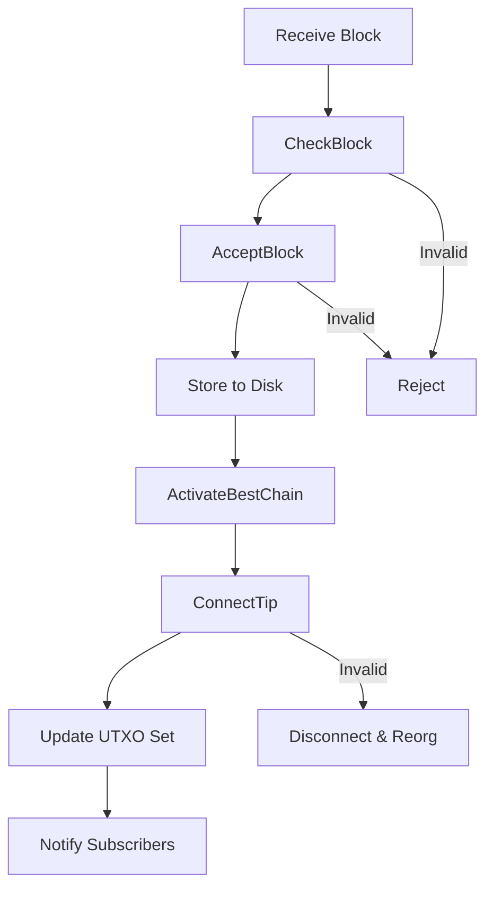
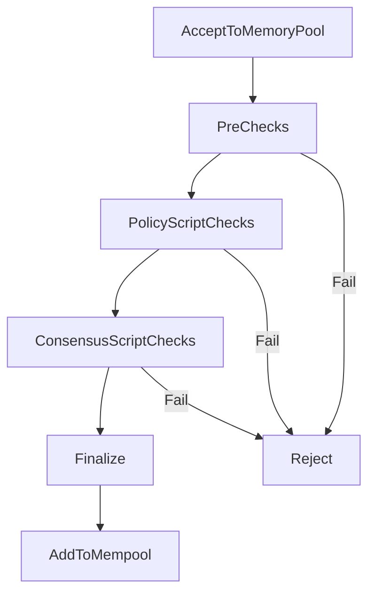
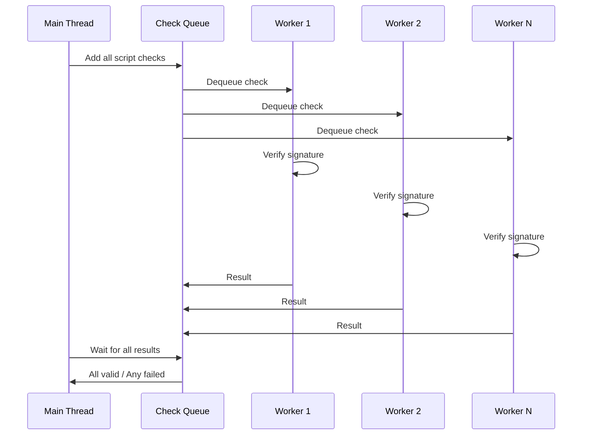

## Overview

The validation engine is the core component responsible for verifying that blocks and transactions conform to Bitcoin's consensus rules. It ensures the integrity and security of the blockchain by rejecting invalid data and maintaining the UTXO (Unspent Transaction Output) set.

The validation code primarily lives in:
- `src/validation.cpp` - Main validation logic
- `src/consensus/` - Consensus-critical components
- `src/script/interpreter.cpp` - Script verification
- `src/kernel/` - Kernel library (consensus engine)

## Validation Architecture

### ChainstateManager

The `ChainstateManager` is the top-level coordinator for validation:

```cpp
class ChainstateManager {
    std::unique_ptr<Chainstate> m_ibd_chainstate;    // IBD/normal chainstate
    std::unique_ptr<Chainstate> m_snapshot_chainstate; // Optional snapshot
    BlockManager m_blockman;                          // Block storage
    // ...
};
```

**Responsibilities:**
- Manages one or two `Chainstate` objects
- Coordinates assumeutxo snapshot loading
- Provides unified interface for validation
- Manages block storage and indexing

### Chainstate

A `Chainstate` represents a view of the blockchain:

```cpp
class Chainstate {
    CCoinsViewCache m_coins_view;  // UTXO set view
    CChain m_chain;                // Active chain
    // ...
};
```

**Key properties:**
- Maintains UTXO set in LevelDB
- Tracks active chain (best chain)
- Can operate independently (for assumeutxo)

## Block Validation Flow

Block validation occurs in multiple stages, each with increasing levels of verification:



### Stage 1: CheckBlock (Context-Free)

Performs validation that doesn't require chain context:

```cpp
bool CheckBlock(const CBlock& block, BlockValidationState& state)
```

**Checks:**
- Block size within limits (≤ 4MB weight)
- Valid proof-of-work (hash meets difficulty target)
- Valid timestamp (not too far in future)
- First transaction is coinbase, others are not
- All transactions are syntactically valid
- Merkle root matches transaction list
- No duplicate transactions

**Validation level:** `BLOCK_VALID_TREE`

### Stage 2: ContextualCheckBlock

Validation requiring chain context but not UTXO set:

**Checks:**
- Block timestamp ≥ median of last 11 blocks
- Coinbase height matches (BIP34)
- Witness commitment present if SegWit active (BIP141)
- Coinbase transaction structure
- Transaction finality (locktime)

### Stage 3: AcceptBlock

Accepts block header and stores block data:

```cpp
bool AcceptBlock(const std::shared_ptr<const CBlock>& pblock,
                 BlockValidationState& state,
                 CBlockIndex** ppindex)
```

**Actions:**
- Verify header connects to known chain
- Check proof-of-work difficulty
- Store block to disk (blk*.dat files)
- Add to block index
- Update block status to `BLOCK_HAVE_DATA`

**Validation level:** `BLOCK_VALID_TRANSACTIONS`

### Stage 4: ConnectBlock (Full Validation)

The most intensive validation - verifies all consensus rules:

```cpp
bool ConnectBlock(const CBlock& block, BlockValidationState& state,
                  CBlockIndex* pindex, CCoinsViewCache& view)
```

**Checks:**
- Transaction inputs exist in UTXO set
- No double-spends
- Coinbase amount ≤ subsidy + fees
- BIP30: No duplicate transaction IDs
- Script verification (signatures, timelocks, etc.)
- SegWit rules (witness commitment, weight limits)
- Taproot rules (BIP340-342) if active

**Actions:**
- Update UTXO set (remove inputs, add outputs)
- Generate undo data (for reorgs)
- Calculate block subsidy and fees
- Verify witness commitment

**Validation level:** `BLOCK_VALID_SCRIPTS`

## Transaction Validation

### Mempool Acceptance

Transactions entering the mempool go through `AcceptToMemoryPool()`:



### Validation Stages

#### 1. PreChecks (Policy)

**Checks:**
- Transaction size limits
- Minimum relay fee
- Non-standard transaction checks
- Inputs available in UTXO + mempool
- No conflicts (unless RBF)
- Locktime/sequence validation

#### 2. Policy Script Checks

**Checks:**
- Standard script types
- Script size limits
- Signature operation counts (sigops)
- Witness program validation

#### 3. Consensus Script Checks

Full script execution and signature verification:

- Execute scripts in parallel using `CCheckQueue`
- Verify ECDSA/Schnorr signatures
- Check script semantics (OP codes, stack operations)
- Validate witness data

#### 4. Finalize

**Actions:**
- Calculate modified fees (with prioritization)
- Determine transaction dependencies
- Check mempool limits and eviction
- Replace-by-fee (RBF) processing if applicable

### Transaction Validation Result

```cpp
enum class TxValidationResult {
    TX_RESULT_UNSET,
    TX_CONSENSUS,           // Consensus violation
    TX_INPUTS_NOT_STANDARD, // Non-standard inputs
    TX_NOT_STANDARD,        // Non-standard transaction
    TX_MISSING_INPUTS,      // Inputs not found
    TX_PREMATURE_SPEND,     // Timelocks not satisfied
    TX_WITNESS_MUTATED,     // Witness malleation
    TX_CONFLICT,            // Double-spend
    TX_MEMPOOL_POLICY,      // Mempool policy violation
    TX_RECONSIDERABLE,      // May work in package
};
```

## Script Validation

Script validation is the most complex part of transaction validation.

### Script Interpreter

The script interpreter (`src/script/interpreter.cpp`) executes Bitcoin Script:

```cpp
bool EvalScript(std::vector<std::vector<unsigned char>>& stack,
                const CScript& script,
                unsigned int flags,
                const BaseSignatureChecker& checker,
                SigVersion sigversion,
                ScriptError* error)
```

### Verification Flags

Script verification behavior is controlled by flags:

```cpp
enum {
    SCRIPT_VERIFY_NONE = 0,
    SCRIPT_VERIFY_P2SH = (1U << 0),
    SCRIPT_VERIFY_STRICTENC = (1U << 1),
    SCRIPT_VERIFY_DERSIG = (1U << 2),
    SCRIPT_VERIFY_CHECKLOCKTIMEVERIFY = (1U << 9),
    SCRIPT_VERIFY_CHECKSEQUENCEVERIFY = (1U << 10),
    SCRIPT_VERIFY_WITNESS = (1U << 11),
    SCRIPT_VERIFY_TAPROOT = (1U << 17),
    // ... many more
};
```

Flags are determined by:
- Block height (soft fork activation)
- Network (mainnet vs testnet)
- Validation context (mempool vs block)

### Signature Verification

Signature verification varies by script type:

#### Legacy (P2PKH/P2SH)
- ECDSA signatures using secp256k1
- DER encoding enforced (BIP66)
- Low-S values required (BIP146)

#### SegWit v0 (P2WPKH/P2WSH)
- ECDSA with BIP143 signature hash
- Witness data separate from transaction
- Quadratic hashing fix

#### SegWit v1 (Taproot/P2TR)
- Schnorr signatures (BIP340)
- BIP342 signature hash (Tapscript)
- Batch verification possible
- Key path spending or script path spending

### Signature Cache

To avoid redundant verification, valid signatures are cached:

```cpp
class SignatureCache {
    // CuckooCache for efficient membership testing
    // Stores: (signature, pubkey, message) -> valid
};
```

**Benefits:**
- Blocks contain transactions already in mempool
- Reorgs may re-validate same transactions
- Cache hit rate typically >95% for blocks

## Parallel Validation

### Script Verification Queue

Bitcoin Core uses a thread pool for parallel script verification:

```cpp
template<typename T>
class CCheckQueue {
    std::vector<std::thread> m_worker_threads;
    // ...
};
```

**Configuration:**
- Default: Use all available CPU cores
- Maximum: 15 threads (`MAX_SCRIPTCHECK_THREADS`)
- Command line: `-par=<n>`

**Workflow:**
1. Main thread queues all transaction checks
2. Worker threads process checks in parallel
3. Main thread waits for completion
4. Any failure aborts entire block validation

### CheckQueue Design



## UTXO Set Management

### Coins View Hierarchy

The UTXO set is accessed through a view hierarchy:

```cpp
CCoinsViewDB        // Base layer: LevelDB
  ↑
CCoinsViewCache     // Caching layer: In-memory
  ↑  
CCoinsViewCache     // Transaction-level cache
```

### CCoinsViewCache

Provides efficient UTXO access and modification:

```cpp
class CCoinsViewCache {
    std::unordered_map<COutPoint, CCoinsCacheEntry> cacheCoins;
    // ...
    
    bool GetCoin(const COutPoint &outpoint, Coin &coin);
    void AddCoin(const COutPoint &outpoint, Coin&& coin);
    bool SpendCoin(const COutPoint &outpoint, Coin* moveto);
};
```

**Optimizations:**
- Batch writes to LevelDB
- Dirty flag tracking
- Lazy deletion (flag as spent, flush later)
- Cache size limits with LRU eviction

## Reorg Handling

Blockchain reorganizations require disconnecting and reconnecting blocks:


### Disconnect Process

```cpp
bool DisconnectBlock(const CBlock& block,
                     CBlockIndex* pindex,
                     CCoinsViewCache& view)
```

**Actions:**
1. Load undo data (rev*.dat)
2. Remove transaction outputs from UTXO
3. Restore spent outputs from undo data
4. Return transactions to mempool (if policy-valid)

### Undo Data Format

Each block stores undo information:

```cpp
class CBlockUndo {
    std::vector<CTxUndo> vtxundo;  // One per transaction (except coinbase)
};

class CTxUndo {
    std::vector<Coin> vprevout;    // Coins spent by this transaction
};
```

## Assumeutxo

Assumeutxo allows fast sync using UTXO snapshots:

### Dual Chainstate Mode

```
Snapshot Chainstate          Background Chainstate
[Snapshot] -> [Tip]          [Genesis] -> [Snapshot]
     ↓                              ↓
   Active                     Validation Only
```

### Snapshot Validation

1. **Load snapshot**: Deserialize UTXO set at specific height
2. **Sync to tip**: Snapshot chainstate becomes active
3. **Background validation**: Original chainstate validates from genesis
4. **Merge**: When background reaches snapshot height, compare UTXO hash
5. **Finalize**: Keep snapshot chainstate as fully validated

## Performance Considerations

### Validation Caching

- **Signature cache**: Avoid re-verifying signatures
- **Script cache**: Cache entire script execution results
- **UTXO cache**: Keep hot UTXOs in memory (default: 450MB)

### Parallel Processing

- Script verification across multiple threads
- Block download and validation can overlap
- Assumes scripts are independent (no global state)

### Database Tuning

- LevelDB block cache: 8MB default
- UTXO cache: Configurable via `-dbcache`
- Batch writes: Flush periodically, not per transaction

## Validation Interface

Components register for validation events:

```cpp
class CValidationInterface {
    virtual void BlockConnected(const std::shared_ptr<const CBlock>&,
                               const CBlockIndex*);
    virtual void TransactionAddedToMempool(const CTransactionRef&);
    virtual void BlockDisconnected(const std::shared_ptr<const CBlock>&);
    // ...
};
```

**Subscribers:**
- Wallet: Update balances and transactions
- ZMQ: Publish notifications
- Indexes: Update transaction/block indexes

## Error Handling

### Validation States

```cpp
class BlockValidationState {
    enum BlockValidationResult {
        BLOCK_RESULT_UNSET,
        BLOCK_CONSENSUS,
        BLOCK_CACHED_INVALID,
        BLOCK_INVALID_HEADER,
        BLOCK_MUTATED,
        BLOCK_MISSING_PREV,
        BLOCK_INVALID_PREV,
        BLOCK_TIME_FUTURE,
    };
};
```

Different results trigger different behaviors:
- **BLOCK_CONSENSUS**: Ban peer
- **BLOCK_INVALID_HEADER**: Disconnect peer
- **BLOCK_MISSING_PREV**: Request missing blocks

## Related Documentation

- [Architecture Overview](/development/architecture-overview)
- [Mempool](/development/mempool)
- [Consensus Layer](/development/consensus-layer)
